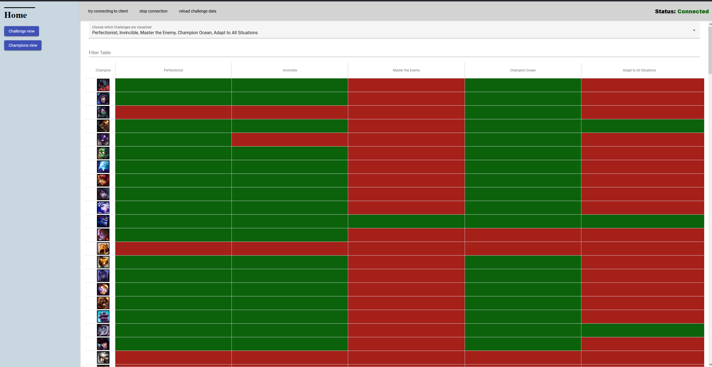

# [LCU Challenge Viewer]
was created under Riot Games' "Legal Jibber Jabber" policy using assets owned by Riot Games.  Riot Games does not endorse or sponsor this project.

> Simple tool to see the advancement of LoL challenges.

# How to use

> Open .exe and league client

> visit "http://localhost:8080" in a browser 

# Download (Windows only)

Go to the [latest release](https://github.com/Feedmon/LCU-Challenge-Viewer/releases/latest) download the exe.
An up to date java version is needed.

> Windows will warn you that this exe is not safe, because it's an unsigned exe. Feel free to look at the code to see what it does.
