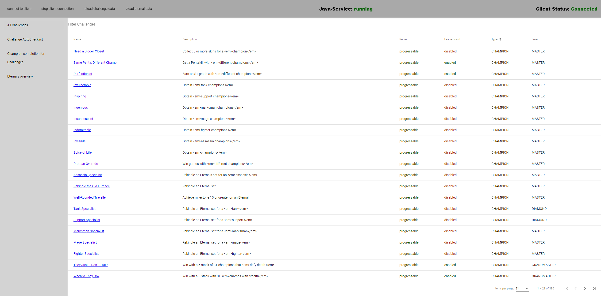
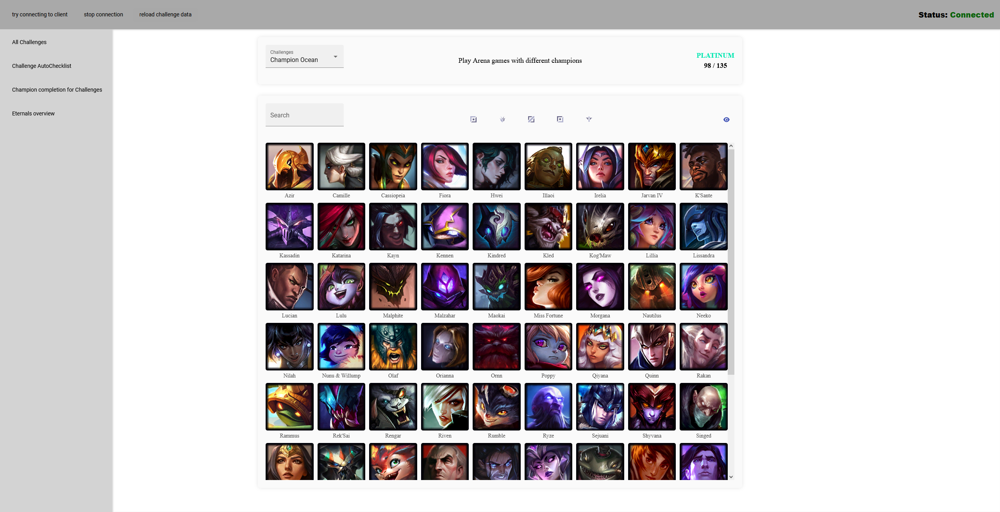
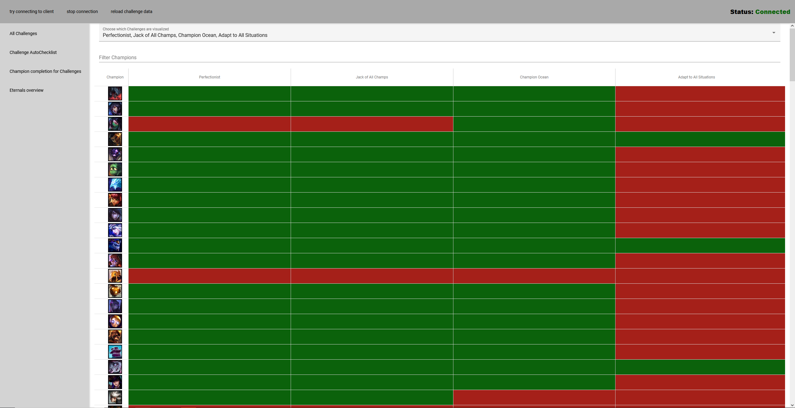
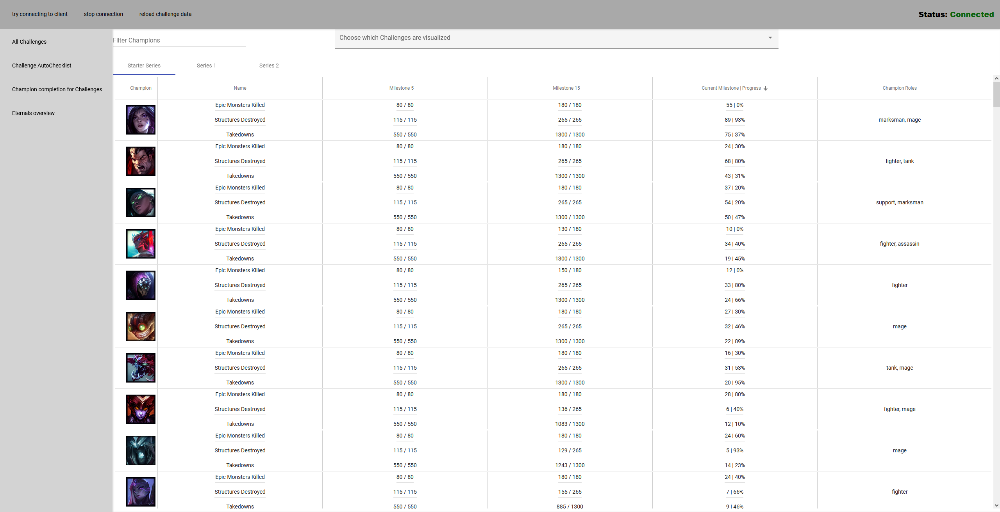

# [LCU Challenge Viewer]
was created under Riot Games' "Legal Jibber Jabber" policy using assets owned by Riot Games.  Riot Games does not endorse or sponsor this project.

> Simple tool to see the advancement of LoL challenges.

> sortable by clicking on table header

> configurable with different challenges to be visualized

> milestone progression is sortable by clicking on header

# How to use since v1.3.1 (Windows only)
* open exe and let installer run
* app wil open immediately after installation
* standard installation folder is C:\users\ (your user)\AppData\Local\Programs\lcu-challenge-viewer
* league client can be opened and closed whenever, some functions won't work with a closed client.

# Download (For Windows)

* Go to [latest release](https://github.com/Feedmon/LCU-Challenge-Viewer/releases/latest) download the installer exe and run it.
* An up to date java version is needed to run it. (https://www.oracle.com/ch-de/java/technologies/downloads/#java21)
